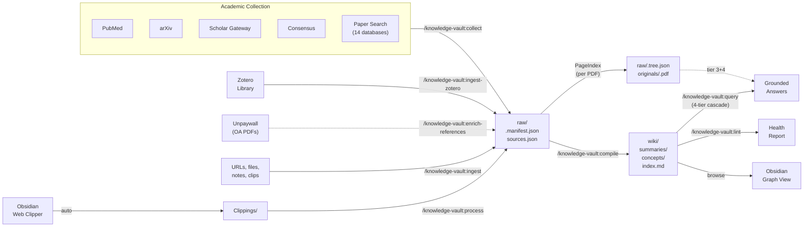
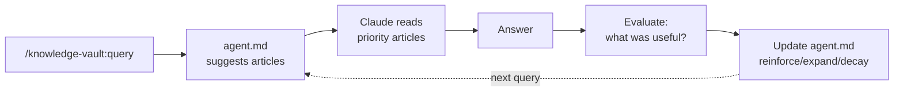

<p align="center">
  <h1 align="center">Knowledge Vault</h1>
  <p align="center">
    <strong>A local, LLM-powered knowledge base that ingests from Zotero, academic databases, and the web.</strong>
    <br />
    Pull papers from your Zotero library. Batch-search PubMed, arXiv, Scholar, Consensus. Enrich reference-only items with open-access PDFs. Preserve every original PDF under bibliographic slugs and auto-build a hierarchical PageIndex tree per document. Compile a cross-referenced wiki. Query through a 4-tier reasoning cascade (index → wiki → tree → page-level extraction). Browse in Obsidian.
  </p>
  <p align="center">
    <a href="LICENSE"></a>
    <a href="https://docs.anthropic.com/en/docs/claude-code"></a>
    <a href="https://obsidian.md"></a>
    <a href="https://modelcontextprotocol.io"></a>
  </p>
</p>

<br />

> Built on ideas from [Andrej Karpathy's LLM knowledge base approach](https://x.com/karpathy/status/1906365823148564901), the [agno-agi/pal](https://github.com/agno-agi/pal) architecture, and the [farzaa/wiki](https://github.com/farzaa/wiki) pattern.

<br />

## What It Does

Knowledge Vault is a [Claude Code](https://docs.anthropic.com/en/docs/claude-code) and Codex plugin that turns any project directory into a structured knowledge base. It **batch-ingests from your Zotero library** and from academic databases (PubMed, arXiv, Scholar Gateway, Consensus, Paper Search) via MCP servers — then compiles the raw sources into a cross-referenced wiki you can query.



**Claude and Codex maintain all wiki content. You browse and query -- never edit directly.**

<br />

## Install

Release notes are tracked in the [Changelog](./CHANGELOG.md).

### New install (Claude Code)

**Step 1** — Add the marketplace (one time only):

```bash
/plugin marketplace add psypeal/knowledge-vault
```

**Step 2** — Install the plugin:

```bash
/plugin install knowledge-vault@knowledge-vault
```

**Step 3** — Reload:

```bash
/reload-plugins
```

No config, no dependencies, no API keys.

### Update

When a new version is released, refresh the marketplace to pull the latest:

```bash
/plugin marketplace update knowledge-vault
```

Then reload so the new commands, scripts, and fixes take effect:

```bash
/reload-plugins
```

If auto-update is enabled for this marketplace, the plugin updates automatically during the marketplace refresh. Otherwise, toggle it via `/plugin` → **Marketplaces** → select `knowledge-vault` → **Enable auto-update**.

### New install (Codex)

**Step 1** — Add the marketplace:

```bash
codex plugin marketplace add psypeal/knowledge-vault
```

**Step 2** — Install the plugin:

```bash
codex plugin add knowledge-vault@knowledge-vault
```

Then open the plugin in the Codex app and accept the install prompt.

### Uninstall

```bash
/plugin uninstall knowledge-vault@knowledge-vault
```

To uninstall from a specific scope, use the `/plugin` **Installed** tab — select the plugin and choose **Uninstall**.

### Migrating from v1 (skill)

Existing vaults are untouched — the `.vault/` directory format is unchanged.

```bash
# 1. Remove the old skill
rm -rf ~/.claude/skills/knowledge-vault
```

Then in Claude Code:

```bash
/plugin marketplace add psypeal/knowledge-vault
```

```bash
/plugin install knowledge-vault@knowledge-vault
```

```bash
/reload-plugins

# 3. Done — your existing .vault/ directories work as-is
```

See [Migration](#migration) for full details.

<br />

## Quick Start

```
> /knowledge-vault:init
  Vault initialized at .vault/

  Let me configure your vault preferences.

  What domain is this vault for?
> Neuroimaging and neurodegeneration research

  Preferences saved to .vault/preferences.md

  Tip: Run /knowledge-vault:setup-sources to configure academic databases.

> /knowledge-vault:setup-sources
  Detected:
    PubMed (Claude.ai built-in)         active
    Scholar Gateway (Claude.ai built-in) active

  Available to add:
    Consensus       claude mcp add --transport http consensus https://mcp.consensus.app/mcp
    arXiv           claude mcp add arxiv-mcp-server -- uvx arxiv-mcp-server ...
    Paper Search    claude mcp add paper-search -- npx -y paper-search-mcp-nodejs

  Which servers would you like to add?
> Consensus and arXiv

  Added 2 servers. Sources saved to .vault/sources.json

> /knowledge-vault:collect tau PET imaging neurodegeneration --since 2023
  Searching PubMed, Scholar Gateway, Consensus, arXiv...

  | # | Title                                         | Source   | Date | Type   |
  |---|-----------------------------------------------|----------|------|--------|
  | 1 | Tau PET imaging in early Alzheimer's disease   | PubMed   | 2024 | paper  |
  | 2 | Longitudinal tau accumulation in subcortical... | Consensus| 2023 | paper  |
  | 3 | Second-generation tau tracers: a review         | arXiv    | 2024 | review |

  Which to ingest? (all / 1,3 / none)
> all

  Ingested 3 sources. 3 pending compilation.

> /knowledge-vault:compile
  Compiled 3 sources. Extracted 7 concepts:
  tau-pet-imaging, neurodegeneration, alzheimers-disease, tau-tracers,
  subcortical-tau, longitudinal-imaging, amyloid-tau-interaction

> /knowledge-vault:query What is the current evidence for second-generation tau tracers?
  Based on the vault: Second-generation tau PET tracers (e.g., [18F]MK-6240,
  [18F]PI-2620) show improved off-target binding profiles compared to
  first-generation [18F]AV-1451. Three vault sources report higher specificity
  for neurofibrillary tau in Braak stages III-IV...
  Sources: [[tau-tracers]], [[tau-pet-imaging]]
```

<br />

## Commands

| Command | Description |
|:--------|:------------|
| **`/knowledge-vault:init`** | Initialize a `.vault/` knowledge base in the current project |
| **`/knowledge-vault:ingest <source>`** | Add a raw source -- URL, pasted text, or file path |
| **`/knowledge-vault:ingest-zotero <collection>`** | Batch ingest papers from a Zotero collection (metadata, fulltext, annotations) |
| **`/knowledge-vault:enrich-references [slug\|--all]`** | Find PDFs for reference-only items via Unpaywall (open-access) and/or Sci-Hub (opt-in) — either source works on its own |
| **`/knowledge-vault:collect <query>`** | Batch search academic databases and selectively ingest results |
| **`/knowledge-vault:setup-sources`** | Configure research MCP servers for academic collection |
| **`/knowledge-vault:compile`** | Compile pending sources into wiki summaries and concept articles |
| **`/knowledge-vault:lint`** | Run 10 health checks on the wiki (incl. originals + tree integrity) |
| **`/knowledge-vault:cleanup`** | Audit and actively fix article quality issues |
| **`/knowledge-vault:query <question>`** | Ask a question grounded in your vault's knowledge |
| **`/knowledge-vault:process`** | Batch: ingest all web clips + compile everything |
| **`/knowledge-vault:status`** | Print a quick status summary |
| **`/knowledge-vault:agent-reset`** | Clear learned retrieval patterns and start fresh |

<br />

## Academic Collection

The headline feature of v2. `/knowledge-vault:collect` searches multiple academic databases in parallel and lets you cherry-pick which results to ingest.

### Supported servers

| Server | Type | Setup | Databases |
|:-------|:-----|:------|:----------|
| **PubMed** | Claude.ai built-in | No setup needed | PubMed, PMC |
| **Scholar Gateway** | Claude.ai built-in | No setup needed | Broad academic literature |
| **Consensus** | HTTP MCP | `claude mcp add --transport http consensus https://mcp.consensus.app/mcp` | Research consensus engine |
| **arXiv** | stdio MCP | `claude mcp add arxiv-mcp-server -- uvx arxiv-mcp-server --storage-path .vault/raw/arxiv-papers` | arXiv preprints |
| **Paper Search** | stdio MCP | `claude mcp add paper-search -- npx -y paper-search-mcp-nodejs` | 14 databases: arXiv, PubMed, Semantic Scholar, bioRxiv, medRxiv, Crossref, CORE, OpenAlex, DOAJ, Europe PMC, Internet Archive Scholar, Fatcat, BASE, DBLP |
| **Zotero** | stdio MCP | `uv tool install zotero-mcp-server && zotero-mcp setup` | Your local Zotero library — collections, metadata, PDF fulltext, annotations |
| **Sci-Hub** *(opt-in, per-project)* | stdio MCP | Run `/knowledge-vault:setup-sources` and select **Sci-Hub** — the short disclosure + auto-install at project scope happen there | Paper retrieval by DOI — used by `/knowledge-vault:enrich-references` as a peer source. Works standalone, or alongside Unpaywall (in which case Unpaywall runs first and Sci-Hub handles what it misses). See the [Advanced section](#advanced-sci-hub-opt-in-per-project). |

### How it works

1. **`/knowledge-vault:setup-sources`** detects what you already have configured and shows what else is available. You approve each server individually.
2. **`/knowledge-vault:collect <query>`** searches all enabled servers in parallel, deduplicates results, and presents a numbered table.
3. You pick which results to ingest -- `all`, specific numbers (`1,3,5`), or filters (`only 2024+`).
4. Selected papers are ingested to `raw/` with full metadata and available text.

The system is elastic and user-controlled. No server is added without your approval. No paper is ingested without your selection.

### Add your own MCP servers

The servers above are pre-configured suggestions, but you can add **any** MCP server as a research source. Just two steps:

1. **Add the server** using `claude mcp add`:
   ```bash
   claude mcp add my-server -- npx -y my-mcp-package
   # or for HTTP servers:
   claude mcp add --transport http my-server https://example.com/mcp
   ```

2. **Register it in your vault** by editing `.vault/sources.json`:
   ```json
   {
     "id": "my-server",
     "name": "My Custom Server",
     "type": "stdio",
     "enabled": true,
     "tools": ["mcp__my-server__search"]
   }
   ```

Once registered, `/knowledge-vault:collect` will include your custom server in batch searches alongside the built-in ones.

### Collect options

```
/knowledge-vault:collect transformers attention mechanisms          # basic search
/knowledge-vault:collect tau PET imaging --since 2023              # papers from 2023 onward
/knowledge-vault:collect CRISPR delivery --count 5                 # max 5 results per source
/knowledge-vault:collect meta-analysis sleep cognition --type review  # filter by type
```

<br />

## Zotero Integration

`/knowledge-vault:ingest-zotero <collection>` batch-imports papers from your **local Zotero library** — metadata, PDF fulltext, and your highlighted annotations — and drops them into the vault's `raw/` directory ready for compilation.

### Setup

Install [54yyyu/zotero-mcp](https://github.com/54yyyu/zotero-mcp) once:

```bash
uv tool install zotero-mcp-server && zotero-mcp setup
```

Then make sure Zotero is running with local API enabled (Zotero 7+: Settings → Advanced → Allow other applications on this computer to communicate with Zotero).

### How it works

```
Zotero collection  ──▶  list items  ──▶  you pick which to ingest
       │
       ▼
  For each paper:
    - metadata (title, authors, year, DOI, BetterBibTeX citekey, Zotero key)
    - PDF fulltext (if attached)
    - your highlighted annotations (if any)
       │
       ▼
  Structured extraction  ──▶  raw/<slug>.md  ──▶  /knowledge-vault:compile
  (~800-1200 words, not the full PDF — the full paper stays in Zotero)
```

### Usage

```
> /knowledge-vault:ingest-zotero hippocampus-review-2024

  Found collection: "Hippocampus Review 2024" (12 items)

  | # | Title                                            | Authors           | Year | Type     |
  |---|--------------------------------------------------|-------------------|------|----------|
  | 1 | Place cell remapping in CA1 after sleep          | Tanaka et al.     | 2024 | paper    |
  | 2 | Entorhinal grid cells and path integration       | Rowland & Moser   | 2023 | paper    |
  | 3 | Hippocampal theta rhythm: a 50-year review       | Buzsáki           | 2024 | review   |
  ...

  Ingest which? (e.g., 1,3,5 or all)
> all

  Ingested 12 papers. Run /knowledge-vault:compile now?
```

### What gets preserved

Each raw file gains extra Zotero-specific frontmatter fields so you can trace back to the source:

```yaml
---
title: "Place cell remapping in CA1 after sleep"
source: "https://doi.org/10.1038/s41593-024-xxxxx"
type: paper
zotero_key: "ABCD1234"
citekey: "tanaka2024place"
doi: "10.1038/s41593-024-xxxxx"
year: 2024
authors: ["Tanaka K", "Moser EI", "..."]
compiled: false
---
```

Re-running the command is safe — existing slugs are skipped, so you can incrementally pull new items as you add them to Zotero.

<br />

## PDF Enrichment

Many Zotero entries — especially those imported from PubMed or Crossref — are **reference-only**: they have metadata and an abstract but no attached PDF. `/knowledge-vault:enrich-references` plugs that gap by looking up each DOI through **Unpaywall** (free, open-access) and/or **Sci-Hub** (opt-in, per-project), then extracting the fulltext into the raw file.

Either source works on its own. When both are configured, Unpaywall runs first per item (free, OA-only, no legal questions) and Sci-Hub handles what it misses.

### Setup

Enable **at least one** source. You can enable both for best coverage.

**Unpaywall** (free, open-access, no signup — just a contact email for polite API use):

```bash
export UNPAYWALL_EMAIL=you@example.com
```

Add the line to `~/.bashrc` or `~/.zshrc` to persist across sessions.

**Sci-Hub** (opt-in, per-project — routes through the community [riichard/Sci-Hub-MCP-Server](https://github.com/riichard/Sci-Hub-MCP-Server); see the [Advanced section](#advanced-sci-hub-opt-in-per-project) for legal context):

```
/knowledge-vault:setup-sources
```

Select **Sci-Hub** when prompted.

Optional: install `poppler-utils` for PDF text extraction (`pdftotext`). On Ubuntu: `sudo apt install poppler-utils`. Without it, the command still retrieves metadata but skips the fulltext replacement step.

### How it works

```
raw/<slug>.md  (has_fulltext: false, doi: "10.xxx/...")
       │
       ▼
  Ask Unpaywall (if enabled)  ──PDF──▶  download + pdftotext
       │                                      │
       miss / disabled                        ▼
       │                            Condense to
       ▼                            Metadata / Abstract /
  Ask Sci-Hub (if enabled)  ──PDF──▶  Key Findings / Methods /
       │                            Quantitative Data
       miss / disabled                        │
       │                                      ▼
       ▼                            Replace raw body +
  Still reference-only              flip has_fulltext: true
```

### Usage

```
> /knowledge-vault:enrich-references
  Scanning raw/... found 5 reference-only items with DOI.
  [1/5] place-cell-remapping               Unpaywall: OA via PLOS ONE      ✓
  [2/5] grid-cells-path-integration        Unpaywall: no OA  →  Sci-Hub    ✓
  [3/5] hippocampal-theta-review           Unpaywall: OA via eLife         ✓
  [4/5] entorhinal-cortex-aging            Unpaywall: no OA  →  Sci-Hub: no PDF  -
  [5/5] memory-consolidation-sleep         Unpaywall: OA via bioRxiv       ✓

  Enriched via Unpaywall: 3
  Enriched via Sci-Hub:    1
  Still reference-only:    1
  Tip: run /knowledge-vault:compile to regenerate summaries for enriched items.
```

(When only one source is enabled, the per-item line shows only that source. The tally omits empty rows.)

Target a single item with `/knowledge-vault:enrich-references <slug>`.

### What changes in the raw file

- Body: replaced with condensed fulltext extraction (Metadata / Abstract / Key Findings / Methods / Quantitative Data), same structure as Zotero ingestion.
- Frontmatter: `has_fulltext: true` and `compiled: false` (so `/knowledge-vault:compile` picks it up next pass).
- No PDFs are stored in the vault — only the extracted text. The plugin does not host or mirror any paper content.

### Coverage

Unpaywall indexes roughly 40-50% of all DOIs, with stronger coverage in biomedical and physics/CS literature. Sci-Hub covers much of the paywalled remainder, with legal trade-offs you need to weigh yourself — see the Advanced section below.

<br />

## PageIndex Tree Indexing *(opt-in, bundled)*

Every PDF that lands in the vault — whether from Zotero, Unpaywall/Sci-Hub enrichment, manual ingest, or the inbox — is preserved under `originals/<slug>.<ext>` (renamed by author/org + year + keyword) and run through [VectifyAI/PageIndex](https://github.com/VectifyAI/PageIndex) to produce a hierarchical "table of contents" tree at `raw/<slug>.tree.json`. The tree drives a finer-grained query path: instead of dumping a whole PDF into context, `/knowledge-vault:query` reasons over the tree to identify the *single section* most likely to hold the answer, then extracts only those pages.

### What a tree looks like

```jsonc
[
  {
    "title": "Methods",
    "node_id": "0003",
    "start_index": 4,
    "end_index": 7,
    "summary": "Randomized double-blind trial. Statin vs placebo in 2,847 adults aged 55-75 over 4 years…",
    "nodes": [
      { "title": "Study population", "start_index": 4, "end_index": 5, "summary": "..." },
      { "title": "Outcome measures", "start_index": 5, "end_index": 7, "summary": "..." }
    ]
  },
  { "title": "Results", "node_id": "0004", "start_index": 8, "end_index": 14, "summary": "..." }
]
```

### Slug rules

| Type | Slug pattern | Example |
|------|--------------|---------|
| `paper` | `<first-author>-<year>-<keyword>` | `vaswani-2017-attention` |
| `report` / `manual` / `filing` / `guideline` | `<org-abbrev>-<year>-<keyword>` | `who-2023-tuberculosis`, `fda-2024-bioequivalence` |
| `article` / `repo` / `dataset` / `meeting` / `notes` / `clip` | title-based (as in v2.3) | `karpathy-llm-os-talk` |

Collisions get `-2`, `-3` suffixes. Original incoming filenames are preserved in frontmatter (`original_filename:`) for provenance.

### Setup

PageIndex is **bundled** at `vendor/PageIndex/` inside the plugin. To enable it:

```
/knowledge-vault:setup-sources
```

Select **PageIndex**. The command then:

1. Verifies `python3` and runs `pip3 install -r vendor/PageIndex/requirements.txt` (one-time).
2. Confirms `ANTHROPIC_API_KEY` is set; writes a `.env` file inside `vendor/PageIndex/` so the runner can authenticate.
3. Smoke-tests the runner.

Tree generation routes through [LiteLLM](https://docs.litellm.ai/docs/providers) → **Claude Sonnet 4.6** (configured in `vendor/PageIndex/pageindex/config.yaml`). A typical 15-page paper takes 30-45 seconds and a few cents of API cost; a 100-page report runs ~1-2 minutes.

If PageIndex isn't set up, the vault works exactly as in v2.3 (flat condense). If it is set up but a tree build fails for a specific PDF, that item silently falls back to flat condense — `has_tree: false` records this so a later retry can rebuild.

### Disable

```bash
rm "${CLAUDE_PLUGIN_ROOT}/vendor/PageIndex/.env"
```

Subsequent ingests fall back to flat `pdftotext` + condense automatically. No command changes needed.

<br />

## Advanced: Sci-Hub (opt-in, per-project)

Sci-Hub is an optional **peer source** for `/knowledge-vault:enrich-references`, routed through the community [riichard/Sci-Hub-MCP-Server](https://github.com/riichard/Sci-Hub-MCP-Server). It is **strictly opt-in and per-project** — never enabled by default, never installed user-globally. You can use it standalone, or alongside Unpaywall (in which case Unpaywall runs first per item and Sci-Hub handles what it misses).

> ⚠️  **About Sci-Hub**
>
> Sci-Hub retrieves research papers by routing around publisher paywalls. Its legal status varies by jurisdiction; some countries and institutions block access to it. By enabling this integration you acknowledge:
>
> 1. You are responsible for complying with copyright law in your jurisdiction.
> 2. This plugin neither hosts, mirrors, nor distributes any Sci-Hub content — it only configures a third-party community MCP server on your machine.
> 3. The opt-in is **per-vault**: enabling it in one project does not enable it anywhere else.

### Enable for the current project

Run inside a project that already has a `.vault/`:

```bash
/knowledge-vault:setup-sources
```

When prompted, select **Sci-Hub** from the available servers. The command then:

1. Shows the disclosure above and asks you to confirm. Any affirmative reply proceeds (`yes`, `y`, `ok`, `sure`, `proceed` — case-insensitive); anything clearly negative cancels.
2. Installs the MCP server: `uv tool install "sci-hub-mcp-server @ git+https://github.com/riichard/Sci-Hub-MCP-Server"`
3. Registers it at **project scope only**: `claude mcp add scihub -s project -- sci-hub-mcp --transport stdio` (writes into this project's `.mcp.json`)
4. Writes a per-vault marker file `.vault/.scihub-enabled`.
5. Prompts you to restart Claude Code so the new MCP tools are picked up.

Sci-Hub is the only MCP that uses `-s project` scope — every other recommended MCP defaults to user scope. This is intentional: Sci-Hub access is opt-in per vault.

After the restart, re-run `/knowledge-vault:enrich-references`. It will use whichever sources are configured; if both Unpaywall and Sci-Hub are enabled, Unpaywall runs first and Sci-Hub picks up anything it couldn't find.

### Disable

```bash
rm .vault/.scihub-enabled
claude mcp remove scihub
```

Both commands are local to the current project. The `uv`-installed binary stays on disk until you run `uv tool uninstall sci-hub-mcp-server` — the plugin does not touch that.

### Why per-project + marker file instead of a global env var

- No edits to your `~/.bashrc` or `~/.zshrc`.
- No accidental Sci-Hub traffic from unrelated projects.
- Easy to audit which vaults have it enabled (`find . -name .scihub-enabled`).

<br />

## Project Structure

After `/knowledge-vault:init` and `/knowledge-vault:setup-sources`:

```
your-project/
  .vault/
  ├── preferences.md       User preferences (interview-generated)
  ├── agent.md             Learned retrieval intelligence (auto-maintained)
  ├── sources.json         Configured research MCP servers
  ├── Clippings/           Obsidian Web Clipper default folder
  ├── inbox/               Manually-dropped artifacts awaiting /knowledge-vault:process
  ├── originals/           Preserved source files renamed to <slug>.<ext>  (NEW in v2.4)
  │   ├── vaswani-2017-attention.pdf
  │   ├── who-2023-tuberculosis.pdf
  │   └── …
  ├── raw/                 Extracted bodies + tree sidecars
  │   ├── .manifest.json   Source registry
  │   ├── <slug>.md        Markdown body (tree-derived outline when has_tree)
  │   ├── <slug>.tree.json PageIndex tree sidecar  (NEW in v2.4)
  │   └── arxiv-papers/    arXiv PDFs (if arXiv server configured)
  ├── wiki/
  │   ├── index.md         Master routing index
  │   ├── _backlinks.json  Reverse link index
  │   ├── concepts/        One article per topic
  │   ├── summaries/       One summary per source
  │   ├── outputs/         Query results and lint reports
  │   └── .state.json      Compilation and lint state
  └── templates/           Frontmatter skeletons
```

<br />

## Personalized Preferences

During `/knowledge-vault:init`, Claude interviews you about your vault's domain and priorities:

```
> /knowledge-vault:init
  Vault initialized at .vault/

  Let me configure your vault preferences.

  What domain is this vault for?
> Biomedical research -- neuroimaging and neurodegeneration

  What sources will you mainly use?
> Papers from PubMed, review articles, and meeting notes

  Any priority rules for sources?
> Peer-reviewed > preprints > blog posts. Prioritize longitudinal studies.

  How granular should concepts be?
> Balanced -- not too broad, not too narrow

  Any special compilation instructions?
> Always extract methodology and sample size. Note statistical methods used.

  Preferences saved to .vault/preferences.md
```

This creates `.vault/preferences.md` -- Claude reads it at the start of **every** vault operation. It shapes how sources are summarized, which concepts are extracted, and how queries are answered.

You can edit `preferences.md` manually anytime. Claude always picks up the latest version.

<br />

## 4-Tier Query Routing

Queries stay efficient at any vault size. Claude never loads everything — it reads the index, picks what's relevant, and drills down only when needed. **Compiled knowledge handles the easy 80% at tier 2; trees route the hard 20% straight to the relevant pages instead of dumping the whole document into context.**

```
Tier 1  ─────  wiki/index.md            Always read first (one-line per entry)
                    │
Tier 2  ─────  summaries/ + concepts/   Read relevant matches (200-500 words each)
                    │              ◄─── Most queries end here.
                    │
Tier 3  ─────  raw/<slug>.tree.json     Reason over PageIndex tree → identify
                    │                    section + page range (NEW in v2.4)
                    │
Tier 4  ─────  pdftotext -f S -l E      Extract just those pages from
               originals/<slug>.pdf      originals/ — quote the precise figure (NEW in v2.4)
```

**Graceful degradation**: vaults from v2.3.0 have no trees and no `originals/`. Tier 3 silently skips; tier 4 falls back to reading `raw/<slug>.md`. The query still works.

<br />

## Compounding Knowledge

Queries answer questions from the vault. When an answer is particularly valuable, you can choose to save it back into the vault, enriching future queries.

### How it works

1. **Query**: Claude reads `wiki/index.md`, picks 2-4 relevant articles, and answers your question with `[[wikilinks]]` to sources.
2. **File it**: If the answer is worth keeping, say "file it". Claude saves it to `wiki/outputs/` and updates the index. Filed answers become available to future queries.
3. **Leave it**: Most queries just return an answer and nothing is saved. Simple lookups pass through without adding noise.

Filing is always user-initiated -- Claude does not automatically classify or save answers.

### Connection strength

When you file an answer that connects multiple concepts, the connection gets a strength rating:

| Strength | Criteria | Graph impact |
|:---------|:---------|:-------------|
| **Strong** | Supported by 2+ independent sources with direct evidence | Added to concept graph |
| **Moderate** | Supported by 1 source with clear evidence | Added to concept graph with note |
| **Weak** | Logically inferred but not directly stated in sources | Recorded in output only -- not added to graph until confirmed by a future source |

### Safeguards

When filing an answer:

- **Deduplication**: Checks if an existing output already covers the same question or connection
- **Graph density cap**: Max 8 `related` entries per concept -- new connections only replace weaker ones
- **Weak connections quarantined**: Speculative links stay in outputs, not in the concept graph, until confirmed

<br />

## Smart Agent

The vault includes a learning retrieval agent (`.vault/agent.md`) that gradually improves article routing based on your query history.

The agent does not activate on every query. It kicks in after a few queries and improves gradually:

- **Pre-routing** (reading agent.md before the index) activates only after 5+ total queries in the vault.
- **Agent updates** (writing back to agent.md) happen only after 3+ queries in the same session.
- Most queries -- especially early ones -- never touch agent.md at all.



Note: The loop above activates after a few queries and improves gradually -- it does not run on every query from the start.

### What it learns

| Section | Max | What it tracks |
|:--------|:----|:---------------|
| **Concept Clusters** | 8 | Groups of concepts frequently queried together |
| **Query Patterns** | 10 | Maps question types to the specific articles that answer them |
| **Source Signals** | 15 | Which sources are most frequently useful and for what |
| **Corrections** | 5 | Retrieval mistakes to avoid repeating |

### How it saves tokens

Without the agent, every query scans the full index and reads 6-8 candidate articles. With the agent, Claude jumps directly to the 2-3 articles that matter.

| Vault size | Agent cost | Savings per query | Net savings |
|:-----------|:-----------|:-----------------|:------------|
| 3 sources | ~225 tokens | ~500 tokens | ~275 tokens |
| 8 sources | ~600 tokens | ~2,500 tokens | ~1,900 tokens |
| 15 sources | ~1,000 tokens | ~4,450 tokens | ~3,450 tokens |

### Safeguards

- **Bounded**: 6,000 character hard ceiling (~1,000 tokens max read cost)
- **Advisory only**: Never overrides `index.md` -- only prioritizes which articles to read first
- **Cold start threshold**: Not activated until 3+ queries or 5+ compiled sources
- **Exponential decay**: Every 20 queries, hit counts halve -- recent patterns outweigh old ones
- **Self-cleaning**: `/knowledge-vault:lint` detects and removes stale references
- **Reset**: `/knowledge-vault:agent-reset` clears all learned patterns if needed

<br />

## Lint Checks

`/knowledge-vault:lint` runs 10 health checks to keep your knowledge base consistent:

| Check | What it catches | Severity |
|:------|:----------------|:---------|
| **Contradictions** | Conflicting claims across different sources | Critical |
| **Stale articles** | Concepts not updated after new sources added | Warning |
| **Missing concepts** | Referenced via `[[wikilink]]` but no article exists | Warning |
| **Orphaned articles** | Concept articles with no sources linked | Warning |
| **Thin articles** | Concept articles under 100 words | Suggestion |
| **Duplicates** | Overlapping concept coverage | Warning |
| **Gap analysis** | Missing topics that would strengthen the knowledge graph | Suggestion |
| **Agent staleness** | agent.md references deleted concepts or sources | Warning |
| **Originals integrity** | `original_path:` points to a missing file, or orphan in `originals/` without a matching raw item | Warning |
| **Tree integrity** | Items with `has_tree: true` whose `<slug>.tree.json` is missing or malformed | Warning |

<br />

## Writing Quality

Articles are written to a strict standard -- factual, precise, no fluff.

**Rules:**
- **Tone**: Flat, factual, Wikipedia-style. Let data imply significance.
- **Avoid**: Peacock words ("groundbreaking", "revolutionary"), editorial voice ("interestingly"), rhetorical questions
- **Do**: One claim per sentence. Short sentences. Replace adjectives with specifics (numbers, dates, methods).
- **Max 2 direct quotes** per article -- choose the most impactful

**Quality safeguards during compilation:**
- **Anti-cramming**: If a concept article develops 3+ distinct sub-topics, split into separate articles
- **Anti-thinning**: Every article must have real substance -- stubs with 2 vague sentences are failures
- **Quality checkpoints**: Every 5 compiled sources, audit the 3 most-updated articles for coherence
- **`/knowledge-vault:cleanup`**: Dedicated command to audit and fix all articles -- restructure diary-style articles into thematic ones, split bloated articles, enrich stubs, fix broken links

<br />

## Obsidian Frontend

Open `.vault/` as an Obsidian vault. Zero configuration needed.

<table>
  <tr>
    <td><strong>Graph View</strong></td>
    <td>Visualize concept connections via <code>[[wikilinks]]</code></td>
  </tr>
  <tr>
    <td><strong>Backlinks</strong></td>
    <td>See every article referencing a concept</td>
  </tr>
  <tr>
    <td><strong>Search</strong></td>
    <td>Full-text search across all articles</td>
  </tr>
  <tr>
    <td><strong>Tags</strong></td>
    <td>Browse by YAML tags across all sources</td>
  </tr>
  <tr>
    <td><strong>Web Clipper</strong></td>
    <td>Clip from browser &#8594; auto-lands in <code>Clippings/</code> &#8594; <code>/knowledge-vault:process</code></td>
  </tr>
</table>

<br />

## What's New in v2

| Feature | v1 (skill) | v2 (plugin) |
|:--------|:-----------|:------------|
| **Architecture** | Claude Code skill | Claude Code plugin with commands, skills, agents, hooks, and scripts |
| **Invocation** | Natural language (`vault compile`) | Slash commands (`/knowledge-vault:compile`) |
| **Academic collection** | Manual URL ingestion only | Batch search across 5 research servers via MCP |
| **Source management** | None | `/knowledge-vault:setup-sources` + `sources.json` config |
| **Research agent** | None | Dedicated vault-collector agent for parallel database search |
| **Session hooks** | None | Auto-detects `.vault/` on session start |
| **Vault format** | `.vault/` directory | Same -- fully backward compatible |

### Summary of changes

- **Plugin architecture**: Commands are now registered slash commands, not natural-language triggers. Skills and agents are separate modules.
- **`/knowledge-vault:collect`**: New command. Searches PubMed, arXiv, Scholar Gateway, Consensus, and Paper Search in parallel. Presents results for selective ingestion. Deduplicates across sources.
- **`/knowledge-vault:setup-sources`**: New command. Detects installed MCP servers, shows available servers with ready-to-run install commands, writes `sources.json`.
- **Session hook**: On session start, detects if the project has a `.vault/` directory and loads vault context automatically.
- **`sources.json`**: New config file tracking which research servers are configured per vault.

<br />

## Migration

Upgrading from v1 (skill) to v2 (plugin):

**Step 1** -- Remove the old skill:
```bash
rm -rf ~/.claude/skills/knowledge-vault
```

**Step 2** -- Install the plugin (in Claude Code):

```bash
/plugin marketplace add psypeal/knowledge-vault
```

```bash
/plugin install knowledge-vault@knowledge-vault
```

```bash
/reload-plugins
```

**Step 3** -- Verify (in any project with an existing vault):
```
> /knowledge-vault:status
```

That's it. Your existing `.vault/` directories are fully compatible. No data migration needed.

**Optional** -- Configure academic sources for an existing vault:
```
> /knowledge-vault:setup-sources
```

### v2.3 → v2.4 (preserved originals + tree indexing)

Existing v2.3 vaults work unchanged. New ingests automatically get `originals/<slug>.<ext>` + `raw/<slug>.tree.json`; old items keep their v2.3 layout. To opportunistically backfill the old items:

```
> /knowledge-vault:cleanup
```

Cleanup detects raw items missing `original_path:` and recovers PDFs through the cleanest available channel — Zotero MCP (when `zotero_key` is on file), Unpaywall/Sci-Hub (when there's a DOI), or direct download (when `source:` points at a PDF). It preserves each PDF under the **existing** v2.3 slug (no rename — keeps `[[wikilinks]]` intact), builds a PageIndex tree if PageIndex is set up, and updates frontmatter only — the markdown body is left alone. Idempotent; re-runnable.

Items with no recoverable source are flagged. Slug heterogeneity (old title-based + new `<author-year-keyword>` style) is expected and benign.

<br />

## Comparison

| | **Knowledge Vault v2** | **[agno-agi/pal](https://github.com/agno-agi/pal)** |
|:---|:---|:---|
| **Runtime** | Claude Code plugin (your terminal) | FastAPI + Docker |
| **Storage** | Markdown + JSON | PostgreSQL + files |
| **Setup** | `git clone` one folder | Docker Compose + API keys |
| **Scope** | Per-project | Global personal agent |
| **Dependencies** | None (optional: `uv`, `npx` for MCP servers) | PostgreSQL, OpenAI API |
| **Academic search** | 5 MCP servers, elastic config | Custom API integrations |
| **Invocation** | `/knowledge-vault:*` slash commands | Chat interface |
| **Browsing** | Obsidian | Custom web UI |

<br />

## Requirements

- [Claude Code](https://docs.anthropic.com/en/docs/claude-code) v2.0+
- `python3` (for JSON updates in helper scripts)
- `uv` *(optional, for arXiv and Zotero MCP servers)*
- `npx` / Node.js *(optional, for Paper Search MCP server)*
- [Zotero](https://www.zotero.org) 7+ *(optional, for `/knowledge-vault:ingest-zotero`)*
- `poppler-utils` *(optional, provides `pdftotext` for `/knowledge-vault:enrich-references` and tier-4 query extraction)*
- `python3` + `pip3` and `ANTHROPIC_API_KEY` *(optional, for PageIndex tree indexing — see [PageIndex Tree Indexing](#pageindex-tree-indexing-opt-in-bundled))*
- [Obsidian](https://obsidian.md) *(optional, for browsing)*

<br />

## Credits

- [Andrej Karpathy](https://x.com/karpathy/status/1906365823148564901) -- LLM knowledge base compilation concept
- [agno-agi/pal](https://github.com/agno-agi/pal) -- manifest tracking, YAML schemas, linting architecture
- [farzaa/wiki](https://github.com/farzaa/wiki) -- wiki-as-knowledge-base pattern
- [blazickjp/arxiv-mcp-server](https://github.com/blazickjp/arxiv-mcp-server) -- arXiv MCP server
- [54yyyu/zotero-mcp](https://github.com/54yyyu/zotero-mcp) -- Zotero MCP server powering `/knowledge-vault:ingest-zotero`
- [Unpaywall](https://unpaywall.org) -- open-access PDF discovery API powering `/knowledge-vault:enrich-references`
- [riichard/Sci-Hub-MCP-Server](https://github.com/riichard/Sci-Hub-MCP-Server) -- community MCP server used by the optional, per-project Sci-Hub source (a fork of JackKuo666's original)
- [VectifyAI/PageIndex](https://github.com/VectifyAI/PageIndex) -- vectorless reasoning-based RAG; vendored under `vendor/PageIndex/` (MIT) to power per-PDF tree indexing and tier-3/4 query routing
- [Galaxy-Dawn/claude-scholar](https://github.com/Galaxy-Dawn/claude-scholar) -- inspiration for the Zotero → knowledge-base workflow

## License

[MIT](LICENSE)
